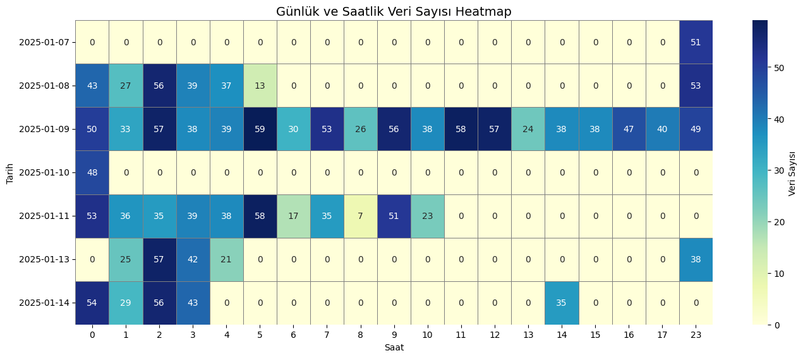
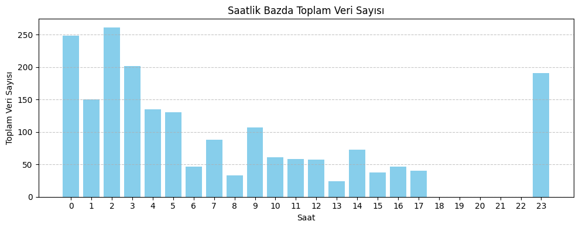
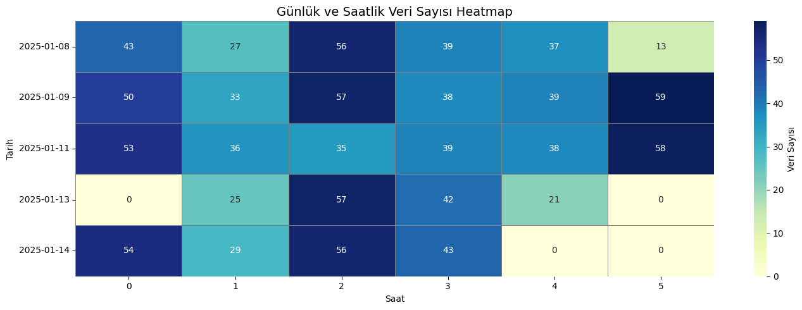
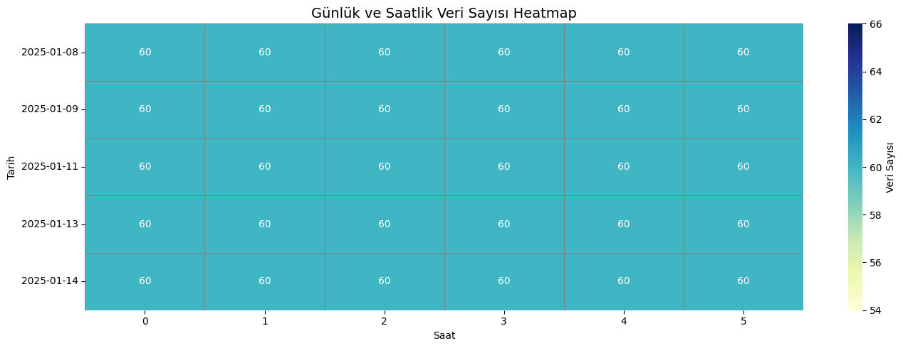

# **520TonEnjPres VERİLERİ TEMİZLEME** 


## Veri Kümesi Genel Bilgiler

- **Gözlem Sayısı (satır)**: 2630  
- **Özellik Sayısı (sütun)**: 13  
- **Zaman Aralığı**: `tarih` sütununa göre zaman serisi formatındadır.  
- **Eksik veri (Hangi sütunda kaç tane eksik veri var? )**: Yok
- **Kapsam**: Enjeksiyon kalıplama sürecine ait üretim verileri.  


## Veri Sütunları ve Açıklamaları

| Sütun Adı | Açıklama |
|-----------|----------|
| **TARİH / tarih** | Üretimin gerçekleştiği tarih ve saat bilgisidir. Zaman serisi analizlerinde kullanılır. |
| **KALIP NO / kalip** | Kullanılan kalıp numarasıdır. Üretimde kullanılan kalıbın tanımlanmasını sağlar. |
| **BASKI NO / cycleSayisi** | Enjeksiyon döngüsünün (çevrim) sayısını ifade eder. Her döngü bir üretim işlemine karşılık gelir. |
| **MAKİNE KODU / makineKodu** | Verinin alındığı enjeksiyon makinesinin kodudur. Çoklu makine analizlerinde ayrım sağlar. |
| **BİRİNCİ FAZ HIZI / SCLPAR_VALUE_V1** | Enjeksiyon işleminin birinci fazındaki hız (mm/sn). Malzemenin kalıba ilk enjekte edilme hızını temsil eder. |
| **PİSTON SÜRTÜNME BASINCI / SCLPAR_VALUE_P1** | Piston hareket ederken oluşan sürtünme kaynaklı basınç (bar). Mekanik performans için önemli bir göstergedir. |
| **İKİNCİ FAZ HIZI / SCLPAR_VALUE_V2** | Enjeksiyonun ikinci fazındaki hız (mm/sn). Kalıbın doldurulma sürecinde belirleyici olur. |
| **İKİNCİ FAZ MESAFE / SCLPAR_VALUE_L2** | İkinci fazda pistonun kat ettiği mesafe (mm). Hacimsel dolumun analizinde kullanılır. |
| **3. FAZ BASINÇ YÜKSELME ZAMANI / SCLPAR_VALUE_TM** | Üçüncü fazdaki basınç artışının süresi (ms). Yavaş basınç artışı kalıp kalitesini etkileyebilir. |
| **3. FAZ BASINCI / SCLPAR_VALUE_P3** | Üçüncü fazdaki nihai enjeksiyon basıncı (bar). Kalıbın tam dolumunu sağlayan basınçtır. |
| **TOPUK BOYU / SCLPAR_VALUE_SM** | Enjeksiyon sonrası pistonun ulaştığı son konum (mm). Kalıp içinde kalan demir miktarını gösterir. |
| **KALIP DOLUM ZAMANI / SCLPAR_VALUE_TR** | Kalıbın tamamen dolması için geçen toplam süre (ms). Kalite ve çevrim süresi açısından kritik bir metriktir. |
| **SPESİFİK BASINÇ BAR / SCLPAR_VALUE_PS** | Üretim sırasında uygulanan özgül basınç (bar). Malzeme kalitesi ve enjeksiyon stabilitesi ile ilişkilidir. |


## Veri Sütunları ve Veri Tipleri

| Sütun Adı             | Veri Tipi      |
|------------------------|----------------|
| `tarih`               | datetime64[ns] |
| `kalip`               | int64          |
| `cycleSayisi`         | int64          |
| `makineKodu`          | object         |
| `SCLPAR_VALUE_V1`     | float64        |
| `SCLPAR_VALUE_P1`     | int64          |
| `SCLPAR_VALUE_V2`     | float64        |
| `SCLPAR_VALUE_L2`     | int64          |
| `SCLPAR_VALUE_TM`     | int64          |
| `SCLPAR_VALUE_P3`     | int64          |
| `SCLPAR_VALUE_SM`     | int64          |
| `SCLPAR_VALUE_TR`     | int64          |
| `SCLPAR_VALUE_PS`     | int64          |


## Veri Ön İşleme

Veri kümesi zaman serisi formatında olduğu için, analizlerde tutarlılığı sağlamak amacıyla aşağıdaki temizleme adımları uygulanmıştır:

### 1. **Tekrarlayan CycleSayisi Değerlerinin Temizlenmesi**
- `cycleSayisi` sütununda bazı tekrar eden döngü numaraları tespit edilmiştir (örn: 54408, 54829, 56763, 56367).
- Her bir `cycleSayisi` değeri benzersiz olmalıdır; bu nedenle tekrar edenlerden **yalnızca ilki** bırakılmış, diğerleri veri kümesinden çıkarılmıştır.

### 2. **Dakikalık Frekansta Veri Tutarlılığı Sağlama**
- `tarih` sütunu incelendiğinde, bazı dakikalarda birden fazla kayıt bulunduğu, bazı dakikalarda ise hiç veri olmadığı gözlemlenmiştir.
- Dakikalık analiz yapılabilmesi için, her dakikadan **yalnızca bir kayıt (ilk gözlem)** bırakılmış, aynı dakikaya ait diğer kayıtlar kaldırılmıştır.


### 3. **Veri Sayısındaki Değişim**
- Temizleme işlemleri sonucunda veri kümesindeki gözlem (satır) sayısı azalmıştır:
  - **Önce**: 2630 satır
  - **Sonra**: 1989 satır

Bu adımlar, zaman serisi analizi ve anomali tespiti gibi işlemlerde daha sağlıklı ve tutarlı sonuçlar elde edebilmek için yapılmıştır.


## Zaman Yoğunluğu ve Eksik Veri Analizi

Veri kümesi zaman serisi tabanlı olduğu için, hangi zamanlarda veri alındığını analiz etmek önemlidir. Bu kapsamda aşağıdaki işlemler yapılmıştır:


### 🕒 Eksik Zaman Aralıklarının Tespiti

`tarih` ve `saat` sütunları baz alınarak eksik zaman dilimleri tespit edilmiştir.  

**Örnek Eksik Gün ve Saatler:**
```
2025-01-14 tarihinde eksik zaman aralıkları:
  - 00:00 ile 00:01 arası eksik  
  - 00:26 eksik  
  - ...  
  - 14:38 eksik  
  - 14:53 ile 23:59 arası eksik  
  - Toplam eksik dakika: 1223 dk

2025-01-12 tarihinde:
  - Tüm gün boyunca veri alınmamış  
  - Toplam eksik dakika: 1440 dk
```

### 🔥 Günlük ve Saatlik Veri Yoğunluğu Heatmap'i

Aşağıdaki heatmap, günün saatlerine göre hangi tarihlerde veri yoğunluğu olduğunu göstermektedir. Daha koyu renkler daha fazla veri kaydını temsil eder.  
Hiç veri alınmayan günler görselde yer almaz.

 


- 2025-01-09 tarihinde veri gün boyunca neredeyse kesintisiz toplanmış; bu tarih en yoğun veri içeren gündür.
- 2025-01-08, 2025-01-11 ve 2025-01-13 tarihlerinde sadece belirli saatlerde veri mevcuttur.
- 2025-01-10 tarihinde yalnızca gece saatlerinde veri alınmış, günün büyük kısmında veri eksiktir.
- Bazı günlerde (örneğin 2025-01-07) yalnızca tek saatlik veri bulunmakta, bu da eksik veri olduğunu göstermektedir.

Bu durum, zaman serisi analizinde dikkat edilmesi gereken eksik veya kesintili veri bölgelerine işaret etmektedir.


## 🧹 Veri Temizleme ve Filtreleme Süreci

### ⛔ Eksik Saatlerin ve Düşük Yoğunluklu Günlerin Çıkarılması

- Veri setinde bazı saat ve gün aralıklarında hiç veri toplanmamıştır.
- Bu nedenle **verisi hiç olmayan saatler (örneğin 20:00 – 22:00)** analiz dışı bırakılmıştır.

 

### 📉 Az Verili Günlerin Filtrelenmesi: En Az 4 Saat Kuralı

- Zaman serisi analizlerinde veri miktarı analiz kalitesini doğrudan etkiler.
- **Verisi 4 saatten az olan günler analizden çıkarılmıştır.**
    - Çok az verili günler:
        - Sağlıklı analiz yapılmasına elverişli değildir,
        - Interpolation gibi veri tamamlama yöntemleri için yetersizdir.
    - 4 saat alt sınırı:
        - Veri kalitesi ile kapsam arasında **dengeli** bir çözüm sağlar.
        - Hem güvenilirlik artar, hem de tahmin hataları azalır.

**Filtre sonrası elde kalan günler:**
```text
2025-01-08, 2025-01-09, 2025-01-11, 2025-01-13, 2025-01-14
```

- Satır sayısı: **1989 → 1890**

---

## 🔍 Yeni Heatmap Gözlemleri

Veri yoğunluğu heatmap'i yeniden incelendiğinde:


 

- Saat 00:00 – 05:59 aralığında, tüm günlerde düzenli veri var:
    - Özellikle saat 02, 03, 04 için yüksek ve tutarlı veri yoğunluğu gözlemleniyor.
- Saat 06:00 – 10:00 arasında bazı veri parçaları var ama çoğu gün eksik.
- Saat 11:00 – 17:00 neredeyse her gün eksik.
- Saat 23:00 bazı günlerde var, ama tutarsız.

### ✅ Önerilen Saat Aralığı: `00:00 - 05:59`

Bu saat aralığı:
- 5 günün 5’inde de veri içerir.
- Veri kalitesi yüksektir.
- Interpolation yapılacaksa sonuçlar güvenilirdir.
- Diğer saatlerdeki eksik veriler, tahmin hatasını artırabilir.

> Satır sayısı: **1890 → 1077**

---


## ⏱️ Dakikalık Veri Tamamlama 

### 🔍 Veri Eksikliği ve Heatmap Gözlemi

Veri setinde her dakika için bir kayıt olması gerekirken, birçok dakikada eksik veri mevcuttu. Bu eksiklikler zaman serisi analizlerinin doğruluğunu ve sürekliliğini olumsuz etkileyebilir.

Aşağıdaki heatmap, 2025-01-08 ile 2025-01-14 tarihleri arasında, her günün saat 00:00 – 05:59 arasındaki saatlik veri yoğunluğunu göstermektedir:



- Bu saat aralığı, eksik dakikaların tamamlanması için hedeflenmiştir.

---

### 🛠️ Uygulanan Veri Tamamlama Adımları

#### 1. Eksik Dakika Kayıtlarının Eklenmesi

- Var olan tüm tarihler için 00:00 – 05:59 aralığında dakikalık zaman serisi oluşturuldu.
- Gerçek veri ile bu eksiksiz zaman tablosu ortak olan `datetime` sütunu üzerinden birleştirildi.
- Böylece eksik zamanlar için yalnızca `datetime` değeri dolu, diğer tüm sütunları `NaN` olan satırlar elde edildi.
- Mevcut veriler korunarak, bu eksik zaman satırları veri setine eklenmiş oldu.


#### 2. `cycleSayisi` Sütununda NaN Olan Satırların Doldurma Stratejisi
`cycleSayisi` kolonu, döngü sayısını temsil ettiğinden özel bir doldurma stratejisi kullanıldı:

**a. Bilinen Değerler Arası**
- Eğer iki bilinen değer eşitse, aradaki eksik değerler aynı değerle dolduruldu.
- Eğer iki bilinen değer farklıysa, **lineer interpolasyon** uygulandı. Yani değerler arası doğrusal artış veya azalışla tahmin edildi.

**b. İlk Bilinen Değerden Önce**
- Gün içindeki ilk bilinen `cycleSayisi` değerinden önceki tüm eksik kayıtlar, bu ilk değerle dolduruldu. (Backward fill)

**c. Son Bilinen Değerden Sonra**
- Son bilinen değerden sonra gelen eksik değerler ise +1 artarak dolduruldu. (Örn: Son bilinen değer 56188 ise → 56189, 56190...)

#### 3. Diğer Sütunlarda NaN Olan Satırların Doldurulması
- `cycleSayisi` dışındaki tüm sütunlar için **forward fill (`ffill`)** uygulandı.
- Bu sayede sensör değerlerinin önceki gözleme dayanarak sürekliliği sağlandı.

#### Gereksiz Sütunların Kaldırılması
- İşlemlerin gerçekleştirlimesi için oluşturulan gereksiz sütunlar kaldırıldı. 
---

### 📈 Sonuç

Heatmap son hali: 





- Veri seti, 1077 satırdan **1800 satıra** çıkarıldı.  (5 gün × 6 saat × 60 dakika)
- Veri seti 13 sütundan oluşuyor. `tarih` sütunu yerine `datetime` sütunu eklendi.
- Eksik zaman noktaları eklendi ve anlamlı şekilde dolduruldu.
- `cycleSayisi` için özel interpolasyon stratejisi sayesinde değerlerin zamansal bütünlüğü korundu.
- Diğer sütunlar için tutarlı `ffill` yöntemiyle eksik veriler tamamlandı.

Bu adımlar sayesinde zaman serisi analizlerine hazır, sürekli ve temiz bir veri seti oluşturuldu.


### 🔄 Zaman Serisine Göre Düzeltme Örneği

**🟠 Başlangıç Verisi (Ham Hali)**

- 1/11/2025 5:57	- 56188
- 1/11/2025 5:55	- 56187
- 1/11/2025 5:55	- 56186
- 1/11/2025 5:54	- 56185

**🔁 Tekrar Eden Zamanlar Temizlendi**

- 1/11/2025 5:57	- 56188
- 1/11/2025 5:55	- 56186
- 1/11/2025 5:54	- 56185

**➕ Eksik Dakikalar Eklendi**

- 1/11/2025 5:57	- 56188
- 1/11/2025 5:56	- NaN
- 1/11/2025 5:55	- 56186
- 1/11/2025 5:54	- 56185

**✅ Eksik Değerler Dolduruldu**

- 1/11/2025 05:57 - 56188.0 
- 1/11/2025 05:56 - 56187.0  
- 1/11/2025 05:55 - 56186.0 
- 1/11/2025 05:54 - 56185.0

