# **520TonEnjPres VERİLERİ ANOMALİ TESPİTİ VE ANALİZİ İLE UYARI SİSTEMİ TASARIMI**

Anomali tespiti, bir veri setindeki normal dışı, yani alışılmadık veya beklenmeyen değerleri belirleme işlemidir.

## 📌 Analiz İçin Seçilen Sütunlar ve Uygunluk Nedenleri

| Sütun Adı             | Açıklama                         | Neden Uygun?                                         |
|-----------------------|----------------------------------|------------------------------------------------------|
| SCLPAR_VALUE_V1       | 1. Faz Hızı                      | Süreçteki ani hız değişimleri                       |
| SCLPAR_VALUE_P1       | Piston Sürtünme Basıncı          | Anormal sürtünmeler, mekanik arızalar              |
| SCLPAR_VALUE_V2       | 2. Faz Hızı                      | Kalıp dolumu hızı, sapmalar önemli                 |
| SCLPAR_VALUE_L2       | 2. Faz Mesafesi                  | Fazlar arası yanlış hareketler                     |
| SCLPAR_VALUE_TM       | 3. Faz Basınç Süresi             | Döngü süresi sapmaları                             |
| SCLPAR_VALUE_P3       | 3. Faz Basıncı                   | Hidrolik/PNÖmatik sorun işareti                   |
| SCLPAR_VALUE_SM       | Yastıklama Uzunluğu              | Kalıp içinde baskı davranışı                      |
| SCLPAR_VALUE_TR       | Kalıp Doldurma Süresi            | Hacimsel akışta dengesizlikler                    |
| SCLPAR_VALUE_PS       | Özgül Basınç                     | Genel performans sapmaları                        |

## 🎯 Neden Rolling Z-Score Yöntemi?
- Zaman serisi verilerinde değişim doğaldır, bu yüzden sabit eşikler yanıltıcı olabilir.
- Rolling Z-Score, her değeri kendi zaman penceresinde değerlendirir.
- Ani sapmaları daha hassas yakalar.
- Üretim süreçlerinde trend değişimlerine duyarlı olması büyük avantaj sağlar.

### Rolling Z-Score Parametre Seçimi: `window = 180`, `threshold = 4`

Bu parametreleri belirlerken, özellikle **SCLPAR_VALUE_V1** sütunundaki değerler incelendi. Bu sütundaki veriler genellikle çok dar bir aralıkta (0.09 - 0.1) değişiyor. Bu nedenle, burada tespit edilen anomalilerin çoğu aslında gerçek dışı (false positive) olabilir.

Bu durumu engellemek için şu yöntem izlenildi:

- **Deneme-yanılma** yöntemiyle farklı `window` ve `threshold` değerlerini test edildi.
- Amaç, **SCLPAR_VALUE_V1 sütununda anomali tespit edilmemesini** sağlarken, diğer sütunlardaki gerçek sapmaları kaçırmamaktı.
- Sonuç olarak, `window=180` ve `threshold=4` değerleri ile **SCLPAR_VALUE_V1** sütununda hatalı anomali işaretlemeleri ortadan kalktı ve daha tutarlı sonuçlar elde edildi.
 

## 📈 Anomali Sayıları

| Sütun                     | Anomali Sayısı |
|--------------------------|----------------|
| SCLPAR_VALUE_P1_anomaly  | 35             |
| SCLPAR_VALUE_P3_anomaly  | 28             |
| SCLPAR_VALUE_PS_anomaly  | 28             |
| SCLPAR_VALUE_TR_anomaly  | 26             |
| SCLPAR_VALUE_TM_anomaly  | 24             |
| SCLPAR_VALUE_V2_anomaly  | 14             |
| SCLPAR_VALUE_SM_anomaly  | 4              |
| SCLPAR_VALUE_L2_anomaly  | 3              |
| SCLPAR_VALUE_V1_anomaly  | 0              |


SCLPAR_VALUE_P1 Rollign Z-Score ile elde edilen anomali tespit grafiği: 

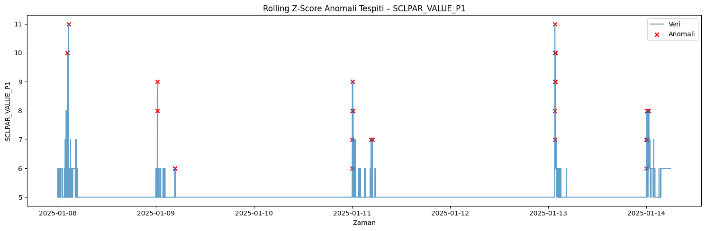 

## 🕒 Aynı Anda Anomali Yoğunluğu

| Aynı Anda Anomali Olan Sütun Sayısı | Kaç Kere Gerçekleşmiş |
|-------------------------------------|------------------------|
| 0                                   | 1718                   |
| 1                                   | 36                     |
| 2                                   | 30                     |
| 3                                   | 4                      |
| 4                                   | 6                      |
| 5                                   | 6                      |


* Toplamda 82 dakikada en az 1 anomali tespit edilmiştir.

Aynı anda görülen saat ve gün bazlı anomali yoğunluğu grafiği:

.png) 

## 🔗 Anomali Korelasyon Matrisi

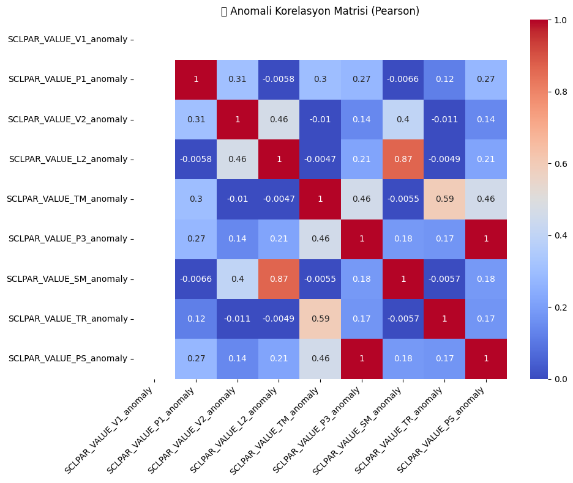 


| Sütun 1                   | Sütun 2                   | Korelasyon | Yorum                                                                 |
|---------------------------|---------------------------|------------|------------------------------------------------------------------------|
| SCLPAR_VALUE_L2_anomaly   | SCLPAR_VALUE_SM_anomaly   | 0.87 ✅    | İkinci faz mesafesi ve boşluk uzunluğu anomalileri birlikte görülüyor. |
| SCLPAR_VALUE_TM_anomaly   | SCLPAR_VALUE_TR_anomaly   | 0.59 ↗     | Üçüncü faz basınç süresi, kalıp dolum süresiyle ilişkili anomali üretiyor. |
| SCLPAR_VALUE_TM_anomaly   | SCLPAR_VALUE_V2_anomaly   | 0.46 ↗     | Basınç süresi ile ikinci faz hızı anomalileri arasında orta düzeyde ilişki var. |
| SCLPAR_VALUE_TM_anomaly   | SCLPAR_VALUE_PS_anomaly   | 0.46 ↗     | Üçüncü faz basınç süresi ile spesifik basınç anomalileri paralellik gösteriyor. |
| SCLPAR_VALUE_V2_anomaly   | SCLPAR_VALUE_L2_anomaly   | 0.46 ↗     | İkinci faz hızı ile ikinci faz mesafesi anomalileri bağlantılı.         |
| SCLPAR_VALUE_P3_anomaly   | SCLPAR_VALUE_TM_anomaly   | 0.46 ↗     | Üçüncü faz basıncı, süresiyle birlikte anomali üretmeye eğilimli.       |
| SCLPAR_VALUE_SM_anomaly   | SCLPAR_VALUE_V2_anomaly   | 0.40 ↗     | Boşluk uzunluğu ile ikinci faz hızı arasında eşzamanlı anomaliler olabilir. |


## 🔍 Anomali Etkisi – Korelasyon Analizi

Her bir sensörde gözlenen anomali durumunda, diğer sensörlerin ortalama ve standart sapmalarındaki değişim analiz edilmiştir. Grafiklerle birlikte değerlendirilmelidir.

- Anomali etkisi değerlendirilirken, yalnızca analiz edilen sütunla korelasyonu 0.4'ün üzerinde olan diğer sensörler dikkate alınmıştır. Bu eşiğin altında kalan kolonlar, zaten düşük bağımlılığa sahip olduğundan, anomali etkisinin anlamlı olmayacağı varsayılmıştır.
---

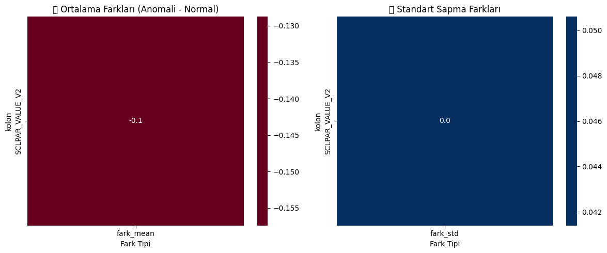 

### 📌 SCLPAR_VALUE_P1 Anomalileri
- V2 değerinde belirgin bir düşüş gözlenmiştir.
- Değişkenlik sabit kalmış, ancak genel seviye düşmüştür.
- Bu durum, piston sürtünme basıncı azaldığında enjeksiyon hızı da düşebilir hipotezini destekler.

---

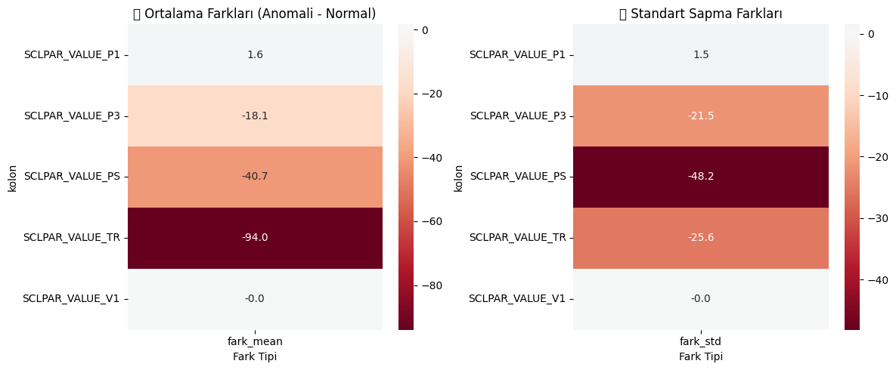 

### 📌 SCLPAR_VALUE_V2 Anomalileri
- TR, PS ve P3 sütunlarında belirgin düşüş gözlenmiştir.
- Sürecin dolum süresi ve basıncı zayıflamış.
- Genel olarak süreç performansı bozulmuş izlenimi verilmiştir.

---

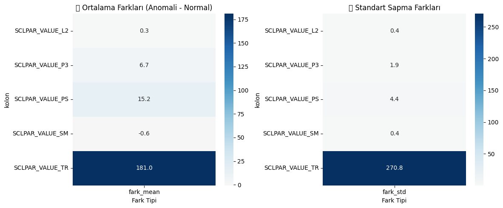 

### 📌 SCLPAR_VALUE_TM Anomalileri
- TR ciddi şekilde artmıştır.
- PS ve P3 de etkilenmiştir ancak daha az seviyede.
- Üçüncü faz basınç süresinin artması, dolum süresinde ciddi dengesizlik yaratmış olabilir.

---

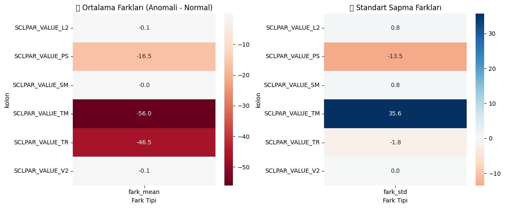 

### 📌 SCLPAR_VALUE_P3 Anomalileri
- TM ve TR düşmüş, PS’de sapmalar artmış.
- Üçüncü faz basıncı azaldığında, kalıp dolum süresi ve basınç süresinde düzensizlik oluşmuş.

---

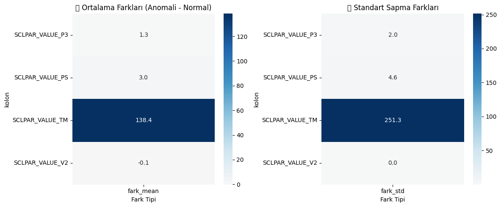 

### 📌 SCLPAR_VALUE_TR Anomalileri
- TM değerleri yükselmiş ve daha düzensiz hale gelmiş.
- PS ve P3’de de düşüşler gözlenmiştir.
- Kalıp dolum süresi arttıkça sistemin basınç yönetimi bozulmuş olabilir.

---

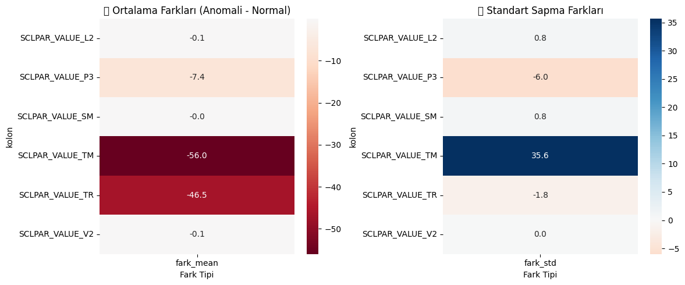 

### 📌 SCLPAR_VALUE_PS Anomalileri
- TM ve TR azalmış, dolayısıyla basınç seviyesi düşükken süreç hızlanmış.
- Ancak bu hızlanma istikrarsız, standard sapma artmış.

---

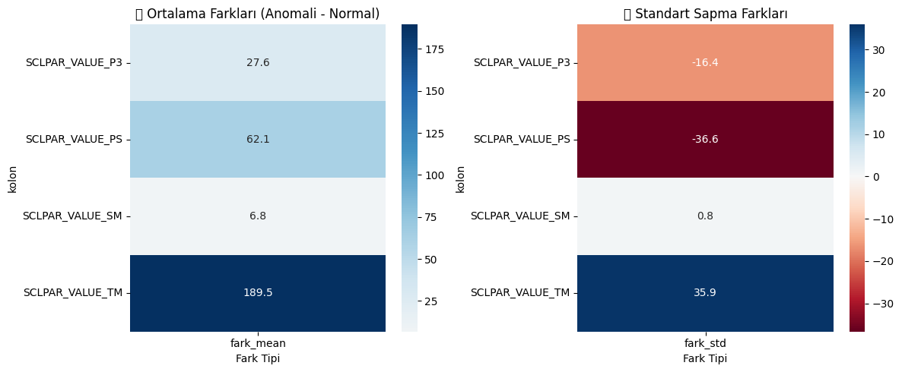 

### 📌 SCLPAR_VALUE_L2 Anomalileri
- TM’de ciddi artış, PS ve P3’de ise kararsızlık gözlenmiştir.
- Bu durum, ikinci faz mesafesi sorunlu olduğunda kalıp dolumunun da etkilenebileceğini gösteriyor.

---

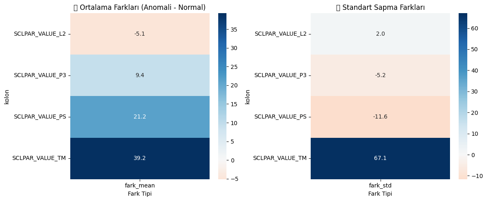 

### 📌 SCLPAR_VALUE_SM Anomalileri
- TM değeri belirgin şekilde artmış.
- PS ve P3’de de bozulma var.
- Yastıklama uzunluğu değiştiğinde sürecin kontrolü zayıflıyor gibi görünüyor.

---

### 🎯 Genel Yorum
Bu analizler, bir sensördeki anomalinin diğer sensörlerde yarattığı etkileri görselleştirerek erken uyarı sistemlerinin temellerini oluşturur. Grafiklerle desteklendiğinde, süreç içi neden-sonuç ilişkileri daha net ortaya çıkar.


## ⚙️ Etkileşim Tabanlı Uyarı Sistemi

### Nasıl Çalışır?
Bu sistem, her bir sensördeki anomalilerin diğer sensörler üzerindeki etkisini değerlendirerek satır bazlı uyarılar üretir. Aşamalar şu şekildedir:

1. Her sensör kolonu için rolling z-score yöntemiyle anomali maskesi oluşturulur.
2. Her bir zaman noktasında (satırda) hangi sensörlerde anomali olduğu kontrol edilir.
3. Eğer hedef sensör o anda anomali gösteriyorsa:
   - Bu sensörün etkilediği diğer sensörler **Anomali Etkisi – Korelasyon Analizi** sonuçlarına göre belirlenir. (`sensor_etkilesim`)
      - Örneğin: "SCLPAR_VALUE_L2": ["SCLPAR_VALUE_TM", "SCLPAR_VALUE_PS", "SCLPAR_VALUE_P3"]
   - Etkilenen sensörün anormal olmayan zamanlardaki ortalama ve standart sapmalar hesaplanır. Bu değerler ±1 std sınırını aşıyorsa :
     - **Evet** → 🔴 *Kritik Anomali* (anomalinin etkisi başka sensöre sıçramış)
     - **Hayır** → 🟡 *Sınırlı Etki* (anomali var ama etkisi düşük)
4. Eğer hiçbir sensörde anomali yoksa veya etkili bir yayılım gözlenmemişse → 🟢 *Normal*
5. Sonuçlar, her satır için açıklayıcı etiketlerle birleştirilir ve yeni bir DataFrame'e kaydedilir.

- Veri setinde "🟢 Normal" dışındaki uyarı yani anomali sayısı 82'dir. 


### Örnek Uyarı Satırları
- `🔴 P1 anomalisi + etkili sapma | 🟡 V2 anomalisi (etki sınırlı)`  

- `🔴 SCLPAR_VALUE_TM anomalisi + etkili sapma | 🔴 SCLPAR_VALUE_P3 anomalisi + etkili sapma`  

- `🟢 Normal`


---

## 🧩 Arıza kümeleri (Anomali Türlerini Gruplandırılır)

Amaç, anomali anlarında sensör değerlerini toplayıp, bunları desenlerine göre gruplamak. Böylece:

- Aynı tip davranış gösteren anomaliler birlikte gruplanır.
- Her bir gruba karşılık gelen olası arıza tipi veya durum profili belirlenebilir.
- Bu gruplar, hem tanı koyma hem de sistem öğrenmesi için kullanılabilir.

### 1. Veriye etkileşim tabanlı uyarı sistemi uygulanır
### 2. Anomali Snapshot'ları Oluşturulur

Her satırda en az 1 anomali varsa, o satırı anomali snapshot kabul edilebilir.
- `anomaly_count` > 0 olan veriler seçiliyor → yani sadece anomali içeren satırlar kullanılıyor
- Yalnızca 9 adet sensör kolonu (`V1`, `P1`, `V2`, `L2`, `TM`, `P3`, `SM`, `TR`, `PS`) alınıyor.

### 3. PCA + KMeans ile Anomali Kümeleme

Aşağıdaki adımlar yapılacak: 
- Tüm sensör verileri StandardScaler ile normalize ediliyor (0 ortalama, 1 std)
- 9 boyutlu veriler, PCA ile 2 boyuta indiriliyor (görselleştirme ve kümeleme kolaylığı için)
- KMeans ile elde edilen 2 boyutlu veriler 3 kümeye (cluster 0, 1, 2) ayrılıyor
- Kümeleri görselleştir, sonuç pca_1 ve pca_2 eksenlerinde scatter plot olarak gösteriliyor


**PCA + KMeans ile anomali kümeleme yöntemi**, çok güçlü bir **"denetimsiz öğrenme" (unsupervised learning)** yaklaşımıdır.

📌 Neden bu yöntemi kullanılıyor?
- Bizim elimizde, “şu satır anomalidir” bilgisi var ✅
- Ama o anomali ne tür bir sorun? Bu bilgi yok ❌

🔧 İşte burada kümeleme devreye giriyor:
- Aynı özellikleri gösteren anomalileri gruplayarak, otomatik olarak farklı anomali tipleri keşfetmemizi sağlıyor.

- **Küme 0** — Hafif/Düşük Riskli Anomali
- **Küme 1** — Aşırı Süre ve Basınç Anomalisi
- **Küme 2** — Yüksek Basınç, Orta Süreli Anomali

**Anomali Kumeleme Grafiği:** 

.png) 

Grafikte 3 kümeye ayrılmış anomali örneklerini net şekilde görülebiliyor.
- Küme 0 (mavi): En yoğun ve ana grup gibi duruyor.
- Küme 1 (turuncu): Açıkça farklı bir dağılıma sahip.
- Küme 2 (yeşil): Az sayıda ama oldukça uçta (outlier gibi), belki ciddi arızalar?

Küme Bazında Ortalama Değerler Grafiği: 

✔️ Her kümenin (örneğin: Kume 0, 1, 2) hangi sensörlerde yüksek ya da düşük değerler aldığını görülebilir.

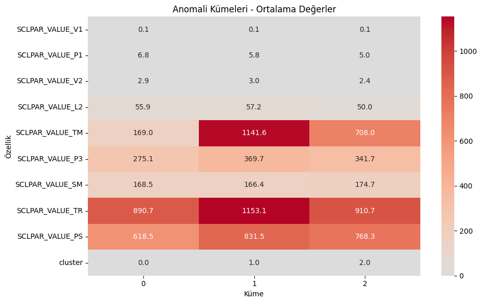 


| Küme | Anomali Tipi              | Açıklama                                                                 |
|------|---------------------------|--------------------------------------------------------------------------|
| 0    | Hafif/Düşük Riskli        | TM, TR ve PS değerleri düşük seviyelerde; diğer sensörlerde belirgin anomali yok. Makine fazla zorlanmadan çalışmış ama yine de standart dışı davranışlar var. |
| 1    | Aşırı Süre ve Basınç      | TM (1141.6) ve TR (1153.1) çok yüksek; PS (831.5) da yüksek. Uzun baskı süresi, kalıbı doldurma süresi ve yüksek spesifik basınç. |
| 2    | Yüksek Basınç, Orta Süre  | TR (910.7) ve PS (768.3) yüksek ancak TM (708.0) küme 1'e göre daha düşük. Makine belirgin şekilde zorlanmış ama süre çok uzamamış. |


**Veri setindeki kümelerin sayıları:**

| Anomaly Type | Satır Sayısı | Açıklama                             |
|--------------|--------------|--------------------------------------|
| NaN          | 1718         | Anomali içermeyen satırlar (normal çalışıyor) |
| 0            | 54           | 0 numaralı anomali kümesi            |
| 1            | 25           | 1 numaralı anomali kümesi            |
| 2            | 3            | 2 numaralı (nadir) anomali kümesi    |


* Anomali içermeyen satırlar (NaN olanlar) 3 ile doldurularak, anomali olmayanlar için yeni grup oluşturuldu.

| anomaly_type | Satır Sayısı |
|--------------|--------------|
| 3.0          | 1718         |
| 0.0          | 54           |
| 1.0          | 25           |
| 2.0          | 3            |

* Oluşturulan bu veri anomali tip bazlı erken uyarı modelinde kullanılacak.


**Gunluk ve saatlik anomali türü dağılım grafiği:** 

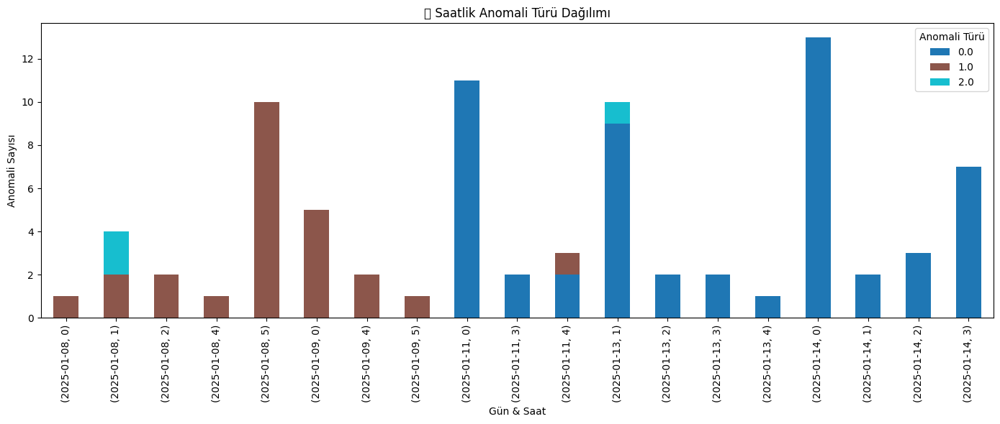 

* Anomali **türü 1** genellikle 08.01 ve 09.01 tarihlerinde baskınken, **tür 0** ise özellikle 11.01–14.01 aralığında artış göstermiştir.


## Anomaly Tip Bazlı Erken Uyarı Modeli

Amaç, her bir gözleme bakarak, anomali tipini (0, 1, 2...) önceden tahmin eden bir model kurmak.

1️⃣ **Model Eğitiminde Kullanılacak Veri**
- Arıza kümeleme sonucunda elde edilen veri seti kullanılır.

Kullanılacak kolonlar:
``` 
 'SCLPAR_VALUE_V1', 'SCLPAR_VALUE_P1', 'SCLPAR_VALUE_V2', 'SCLPAR_VALUE_L2', 'SCLPAR_VALUE_TM', 'SCLPAR_VALUE_P3', 'SCLPAR_VALUE_SM', 'SCLPAR_VALUE_TR', 'SCLPAR_VALUE_PS'
```

2️⃣ **Özellik Önem Analizi (Feature Importance)**
- Modelyukarıdaki kolonlar ile bir kez eğitildikten sonra, hangi sensörlerin karar verirken ne kadar etkili olduğunu görselleştirildi.

 

- En önemli 6 sensör seçildi: 
```
'SCLPAR_VALUE_TR', 'SCLPAR_VALUE_V2', 'SCLPAR_VALUE_PS',
'SCLPAR_VALUE_P1', 'SCLPAR_VALUE_TM', 'SCLPAR_VALUE_P3'
```

4️⃣ **Model Eğitimi**
- 🎯 Hedef: anomaly_type
- 📊 Girdi: 6 sensör kolonu
- Model: RandomForestClassifier


5️⃣ **Model Değerlendirme**
- Eğitim/test ayrımı yapıldı, model performansını ölçüldü:
- %97 doğruluk (accuracy)
- Grup 3 (normal) çok başarılı
- Grup 0 ve 1 gibi küçük örnekli gruplar biraz daha zayıf ama fena değil
- Model, normal ve baskın anomali türlerini yüksek doğrulukla ayırt edebiliyor; az örnekli gruplarda ise ek veri ile daha iyi sonuçlar alınabilir. 
- Anomalilerin sayıları artırılarak model yeniden eğitilebilir. Anomalilerin sayısını arttırmak için de rollig Z-score parametreleri (`window`, `treshold`) değiştirilebilir. 

**confusion_matrix:**

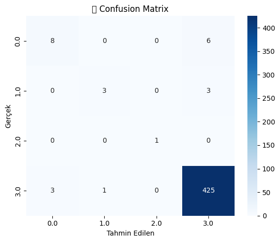 


--- 

# 🛠️ `cycleSayisi` Sütunu Anomali Tespiti

## 🔄 Veri Tekrarları ve Yapay Duruşlar

Yapılan analizlerde `cycleSayisi` sütununda ardışık tekrar eden değerlerin bazıları, üretim durmuş gibi görünse de, aslında veri girişindeki yinelenmelerden kaynaklanmaktadır. 
  - Veri temizleme adımında yapılan `cycleSayisi` sütunundaki eksik veri doldurma işleminden dolayı

---

## ✅ Uyarı Sistemi

`cycleSayisi` ve sensör sütunları birlikte analiz edilerek aşağıdaki uyarı sistemi geliştirilmiştir:

| Etiket | Anlam |
|--------|-------|
| 🟢 Normal | Yeni cycle başlamış, sistem çalışıyor. |
| ❗ Gerçek duruş olabilir | Aynı cycle tekrarı var + sensörlerde hareket var → sistem durmuş olabilir. |
| ⚠️ Veri tekrarı olabilir | Aynı cycle tekrarı var + sensörler hareketsiz → veri tekrarı olabilir. |


## 📊 Özet Bulgular

- **Toplam veri sayısı:** 1800 satır  
- **Gerçek duruş olasılığı taşıyan satır sayısı:** 46  
- **Oran:** ≈ %2.56

### 🔍 Yorum

- Verinin %97’sinden fazlası düzgün ilerliyor.  
- Sadece %2.5'lik kısımda hem `cycleSayisi` tekrarı hem de sensör hareketsizliği tespit edildi.  
- Bu durum, sistemin büyük oranda güvenilir çalıştığını ve potansiyel hataların izlenebilir olduğunu gösteriyor.
