# Anomali Tespiti, Analizleri ve Uyarı Sistemleri Raporu

Temizlenmiş veriye bakıldığında anomali tespiti gibi analizler için, ani 0'lanmalar gösteren (örneğin güç % ve akım amper sütunları) ile daha yumuşak değişkenlik gösteren sütunları ayrılmasına karar verildi. Böylece farklı türde anomalilere farklı metodlarla müdahale edilebilir. 


# “Ani 0'lanmalar Olmayan” VE "Sabit Değerler İçermeyen" SÜTUNLAR ÜZERİNDE ANALİZ

**Seçilen Sütunlar:** 
- `giris_isi`
- `on_isitma_isi`
- `sogutma1_isi`
- `sogutma2_isi`
- `sogutma3_isi`
- `rulo_frekans_hz`
- `giris_per.fan_hz`


## Anomali Analizi (Rolling Z-score Yöntemi)

🔍 Anomali Tespiti Nedir?

Anomali tespiti, bir veri setindeki normal dışı, yani alışılmadık veya beklenmeyen değerleri belirleme işlemidir.

- Veriler 41 iş günü boyunca her gün 08:00-17:00 arasında dakikalık olarak toplandığı için, her gün 540 veri noktasına sahiptir. Bu nedenle, rolling z-score için `window=540` seçilerek her gün kendi içindeki dalgalanmalara göre anomaliler değerlendirilmiştir.


**Sütunlar arası korelason isi haritası:** 

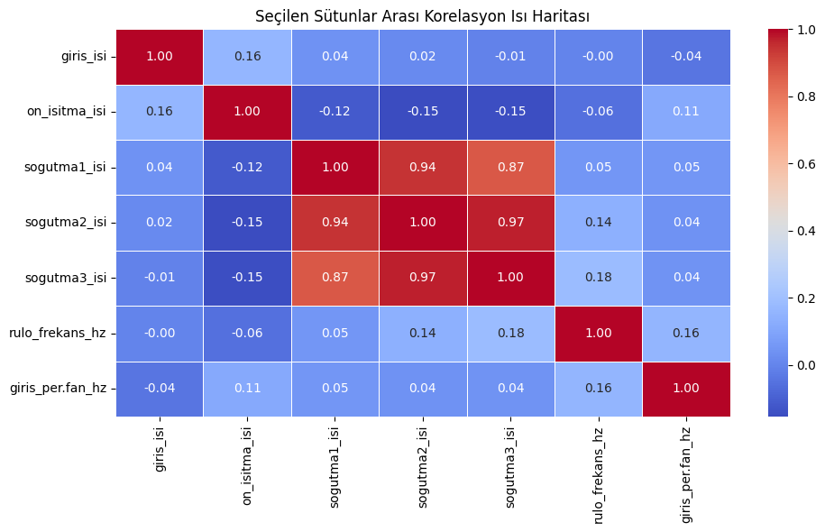

`sogutma1_isi`, `sogutma2_isi`, `sogutma3_isi` aralarındaki korelasyon çok yüksek:
- sogutma1_isi ↔ sogutma2_isi: 0.94
- sogutma2_isi ↔ sogutma3_isi: 0.97
- sogutma1_isi ↔ sogutma3_isi: 0.87

Bu, bu üç soğutma bölgesinin birlikte çalıştığını ve benzer tepki verdiğini gösteriyor.

### `sogutma1_isi`, `sogutma2_isi`, `sogutma3_isi` İçin Rolling Z-score ile Anomali Tespiti  

- Amaç, soğutma sistemine ait üç sıcaklık sensörü (sogutma1_isi, sogutma2_isi, sogutma3_isi) arasında zamanla oluşan dengesizlikleri/anormallikleri tespit etmek.

- Bu sensörler normalde benzer değerler göstermelidir. Aralarındaki rollig z-score farkları çok yükselirse, bu bir anomali olarak değerlendirilir.

Anomaliler tespit edildikten sonra grafiksel olarak gösterilir ve zamanları listelenir.

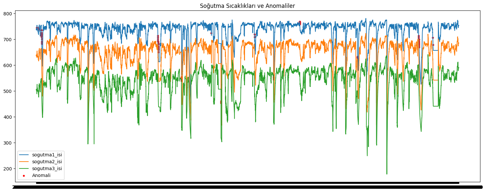

- Toplam Anomali Sayısı: 133

Sistem genel olarak stabil gözüküyor
- Anomali oranı %1'in altında → bu da soğutma sisteminin büyük ölçüde kararlı çalıştığını gösterir.
- Bu oran, üretim gibi sürekli çalışan bir sistemde oldukça kabul edilebilir ve beklenen bir düzeydir.

**`sogutma_anomali` kolonu oluturuldu:**
- df["sogutma_anomali"] == 1 olan satırlar, soğutma sıcaklık sensörleri arasında beklenmeyen bir sapmanın (uyumsuzluğun) olduğu anlamına gelir.
- df["sogutma_anomali"] == 0 olan satırlar, soğutma sıcaklık sensörlerinin birbiriyle tutarlı çalıştığını gösterir.


### 🔍 Diğer Sütunların Anomali Analizi 

- Her tekil sensör kolonu için istatistiksel anomali tespiti yapıldı.

Anomali Sayıları:
- **`giris_isi`:** 725 adet
- **`on_isitma_isi`:** 462 adet
- **`rulo_frekans_hz`:** 514 adet
- **`giris_per.fan_hz`:** 525 adet

#### ⌚ Uzun Süreli Anomaliler (5 dakikadan uzun):

Her anomali sütununda en az 5 ardışık anomali içeren uzun anomali gruplar tespit edilir ve kaç satır içerdiğini yazdırılır.

- Amaç, sadece veri noktası değil, zaman içinde devam eden anormal davranışları analiz edip, bunlara öncelik vermektir.

| 🚨 Anomali Tipi                  | Anomali Sayısı | Yorum                                         |
|-------------------------------|----------------|-----------------------------------------------------|
| 🔥 `giris_isi_anomali`        | 657            | Giriş sıcaklığı sık ve uzun süreli anomali gösteriyor. |
| ♨️ `on_isitma_isi_anomali`    | 414            | Ön ısıtıcıda orta düzeyde sürekli sapmalar var.     |
| ❄️ `sogutma_anomali`          | 112            | Soğutma genel olarak stabil, ancak dönemsel sapmalar olmuş. |
| ⚙️ `rulo_frekans_hz_anomali` | 388            | Frekanslarda sık dalgalanmalar gözlemlenmiş.        |
| 🌬️ `giris_per.fan_hz_anomali`| 354            | Fan hızında uzun süreli anomali durumları var.       |


---

## 🔹 Anomali Etki Analizi (Impact Analysis)

Anomali tespiti yapılan sütunların, diğer hedef sütunlardaki etkileri incelendi. Rollig Z-score ile bulunan anomali zamanlarında diğer sütunların ortalama ve standart sapma değerleri karşılaştırıldı.


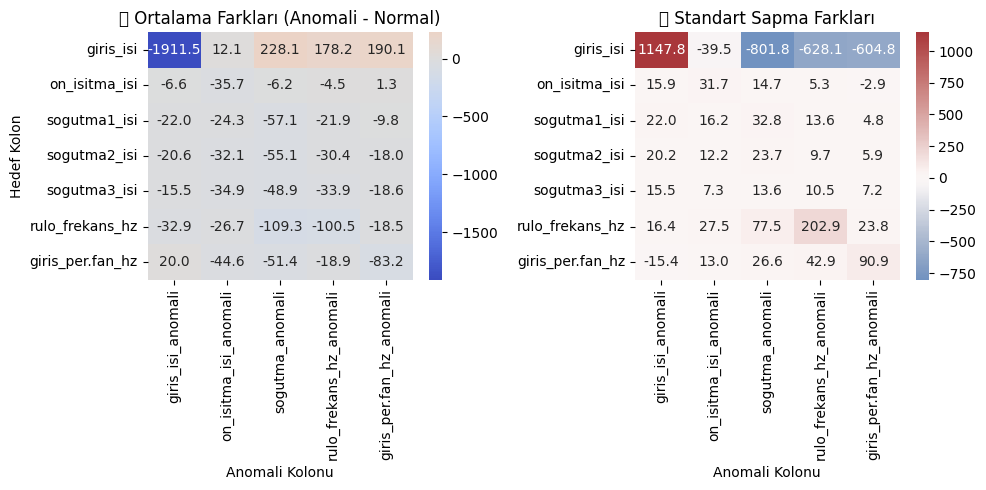

### 📊 Anomali Etki Analizi – Yorumlar

**1. ✅ Ortalama Farkları (Anomali - Normal)**

  - `giris_isi_anomali` anomalisi, `giris_isi` üzerinde çok büyük negatif etkiye sahip (−1911.5). Bu, giriş ısısı anomalisinde sistemin ciddi şekilde soğuduğunu gösterir.

  - Ayrıca `giris_isi` üzerinde, `sogutma_anomali`,`rulo_frekans_hz_anomali` ve `giris_perf_fan_hz_anomali` anomalilerinde etkisi olduğu görülmektedir.

  - `sogutma_anomali` anomalisi; `rulo_frekans_hz`,`giris_per.fan_hz`, `sogutma1_isi`, `sogutma2_isi`ve `sogutma3_isi` soğutma kolonlarında anlamlı düşüşlere neden olmuş. 
  
  - `rulo_frekans_hz_anomali` ve `giris_perf_fan_hz_anomali` ise `rulo_frekans_hz`, `giris_per.fan_hz` gibi hedeflerde güçlü negatif fark yaratmış. Yani bu anomali türleri motor/dönüş sistemlerine etki ediyor olabilir.
  
  - `on_isitma_isi_anomali` farkları ise görece düşük, bu anomali türünün sistemin tamamını sarsmadığını gösteriyor.

**2. 📉 Standart Sapma Farkları**

  - En büyük standart sapma farkı yine `giris_isi_anomali`'de gözlenmiş: 1147.8. Bu, sadece ortalamada değil, dağılımda da ciddi bir değişiklik olduğunu gösteriyor.

  - `giris_isi` standart sapma değerinde de, `sogutma_anomali`,`rulo_frekans_hz_anomali` ve `giris_perf_fan_hz_anomali` anomalilerinde etkisi olduğu görülmektedir.
  
  - `sogutma1_isi_anomali`, `sogutma2_isi_anomali`, `rulo_frekans_hz_anomali` gibi kolonlarda da yüksek sapma farkları var, bu anomalilerin sistem kararlılığını bozduğunu gösterir.

  - `giris_perf.fan_hz_anomali` anomalisi ise hedef kolonlar içinde en çok değişkenliğe neden olanlardan biri, özellikle `giris_per.fan_hz`'de +90.9 fark dikkat çeker.

**🔍 Genel Yorum ve Kullanım Önerisi**

  - `giris_isi_anomali` ve `sogutma*_anomali` türleri, sistemin sıcaklık ve stabilitesini doğrudan ve güçlü şekilde etkiliyor. Bu kolonlar erken uyarı sistemi için yüksek öncelikli olabilir.

  - `rulo_frekans_hz_anomali` ve `giris_perf.fan_hz_anomali`, dönen mekanik parçalarda düzensizliklerin habercisi olabilir. Bunlar mekanik arıza için izlenebilir.

---

## 🚧 Uyarı Sistemi Oluşturma

Amaç, sensor verilerindeki kritik değişimleri algılayan, açıklayıcı ve güvenilir bir uyarı sistemi kurmak.

**Anomali etkiye göre seçilen kritik hedef kolonlar:**
- `giris_isi`
- `sogutma1_isi`
- `sogutma2_isi`
- `sogutma3_isi`
- `rulo_frekans_hz`
- `giris_per.fan_hz`


**Normal Durum İstatistiklerini Hesaplandı**

- Tamamen anomali içermeyen satırları seçip bu kolonların:
  - Ortalama (mean)
  - Standart sapma (std) değerleri hesaplandı. 
- 📦 Bunları stats[col] = {'normal_mean': ..., 'normal_std': ...} şeklinde bir sözlükte tutuldu.

**Her satıra özel anlamlı, fiziksel temelli ve açıklayıcı uyarılar içeren bir uyari kolonu eklendi. Anomali zamanlarında farkları baz alarak kural tanımlandı.**

### 🚨 Anomali Uyarı Kuralları Tablosu

| Uyarı Türü              | Açıklama                                                                 |
|-------------------------|--------------------------------------------------------------------------|
| 🚨 **Giriş Isı Düşüşü**       | Giriş ısısı, normal seviyesinin **2 standart sapma altına** düşerse, sistemde ciddi bir sıcaklık kaybı olabileceğini belirtir. |
| ⚠️ **Soğutma1_isi Düşüşü**    | Soğutma1 ünitesinin sıcaklığı **beklenenden fazla düştüyse**, soğutma sisteminde bir verimsizlik ya da kesinti olabilir. |
| ⚠️ **Soğutma2_isi Düşüşü**    | Soğutma2 ünitesinde sıcaklık **anormal şekilde azalmışsa**, sistemin bu kısmında soğutma performansı bozulmuş olabilir. |
| ⚠️ **Soğutma3_isi Düşüşü**    | Soğutma3 hattındaki sıcaklık, normal seviyesinden **çok düşükse**, bu bölümde işleyişte aksama yaşanıyor olabilir. |
| ⚠️ **Rulo Frekans Artışı**   | Rulo motorunun frekansı **alışılmadık derecede artmışsa**, bu sistemin zorlandığına veya aşırı çalıştığına işaret eder. |
| ⚠️ **Fan Hızı Düşüşü**       | Giriş fanı hızı **belirgin şekilde düştüyse**, havalandırma yetersiz olabilir, bu da verimlilik sorunlarına yol açabilir. |
| ✅ **Normal**                | Hiçbir uyarı kriteri karşılanmadıysa sistem, **beklenen aralıkta çalışıyor** demektir. |

### Örnek Kural Çalışma

Kural: 

```python
row['giris_isi'] < stats['giris_isi']['normal_mean'] - 2 * stats['giris_isi']['normal_std']
```
Örnek mean ve std değerler: 
```python
# Normal döneme ait istatistikler
stats['giris_isi']['normal_mean'] = 850.0
stats['giris_isi']['normal_std'] = 100.0
```

Hesaplama: 
```python
eşik = 850.0 - 2 * 100.0 = 650.0
```
İncelenen örnek satırlar:

```python
row['giris_isi'] = 630.0

row['giris_isi'] = 730.0
```

Koşul Kontrolü: 
```python
630.0 < 650.0  →  ✅ Normal 
730.0 > 650.0  →  🚨 Giriş Isı Düşüşü
```

### Sonuç

Tüm bu işlemler sonucunda `uyari` kolonu oluşturuldu.

- Toplam veri: 22140
- ✅ Normal: 17334
- 🚨 Toplam Uyarı Sayısı: 4766

🔔 Bireysel Toplam Uyarı Sayısı (`uyari` kolonunda birden fazla uyarı olabilir): 7125
- ⚠️ Fan Hızı Düşüşü: 1452
- ⚠️ SOGUTMA2_ISI Düşüşü: 1356
- ⚠️ SOGUTMA1_ISI Düşüşü: 1283
- 🚨 Giriş Isı Düşüşü: 1259
- ⚠️ SOGUTMA3_ISI Düşüşü: 1122
- ⚠️ Rulo Frekans Artışı: 653

**Oluşturulan her satır için bir uyarı etiketine sahip veri son hali sıcaklık-fan-rulo arıza tahmin modelinde* kullanılmak üzere kaydedilir. (ariza_tahmin_modeli_sicaklik_fan_rulo_icin_veri.csv)**

---


# 🔍 GÜÇ (%) ve AKIM (A) TABANLI ANALİZ 

📌 Temel Fiziksel İlişki

Güç (%) değerleri, akım (A) ile doğrusal orantılı olmalıdır.
- Yani: güç yüzdesi / akım ≈ sabit

Bu oran zamanla çok değişiyorsa, sensör arızası, okuma hatası veya ani sıfırlanma gibi anormallikler olabilir.

İşlemlere temizlenmiş veri seti üzerinden devam edilecek.

**Analizde Kullanılacak Güç ve Amper Kolon Çiftleri:**

```

    ('on_isitma_guc_%', 'on_isitma_amp.')
    ('ceh.1_ust1_guc_%', 'ceh.1_ust1_amp.')
    ('ceh.1_ust2_guc_%', 'ceh.1_ust2_amp.')
    ('ceh.1_alt1_guc_%', 'ceh.1_alt1_amp.')
    ('ceh.2_ust1_guc_%', 'ceh.2_ust1_amp.')
    ('ceh.2_ust2_guc_%', 'ceh.2_ust2_amp.')
    ('ceh.2_alt1_guc_%', 'ceh.2_alt1_amp.')
    ('ceh.2_alt2_guc_%', 'ceh.2_alt2_amp.')
    ('ceh.3_ust1_guc_%', 'ceh.3_ust1_amp.')
    ('ceh.3_ust2_guc_%', 'ceh.3_ust2_amp.')
    ('ceh.3_alt1_guc_%', 'ceh.3_alt1_amp.')
    ('ceh.3_alt2_guc_%', 'ceh.3_alt2_amp.')

```

## ⚙️ Analiz Yöntemi

1. İstatistiksel İnceleme (describe)
    - Her güç-akım çifti için temel istatistikler (min, max, ortalama, std) alınır.
    - Tüm bileşenlerde minimum değerler zaman zaman 0, bu da sensör arızası ya da sistemin kapalı olduğu zamanları gösterebilir.

2. Korelasyon Analizi (corr)
    - Güç ve akım arasındaki Pearson korelasyonu hesaplanır, güç artarken akım da artıyorsa, bu pozitif ve güçlü bir ilişki anlamına gelir:
        - corr_deger > 0.90: Güçlü lineer ilişki (sağlıklı sensörler)   
        - corr_deger < 0.80: Ya ilişki zayıf ya da anomali etkisi var

**Güç ve Amper Korelayon Matrisi:**

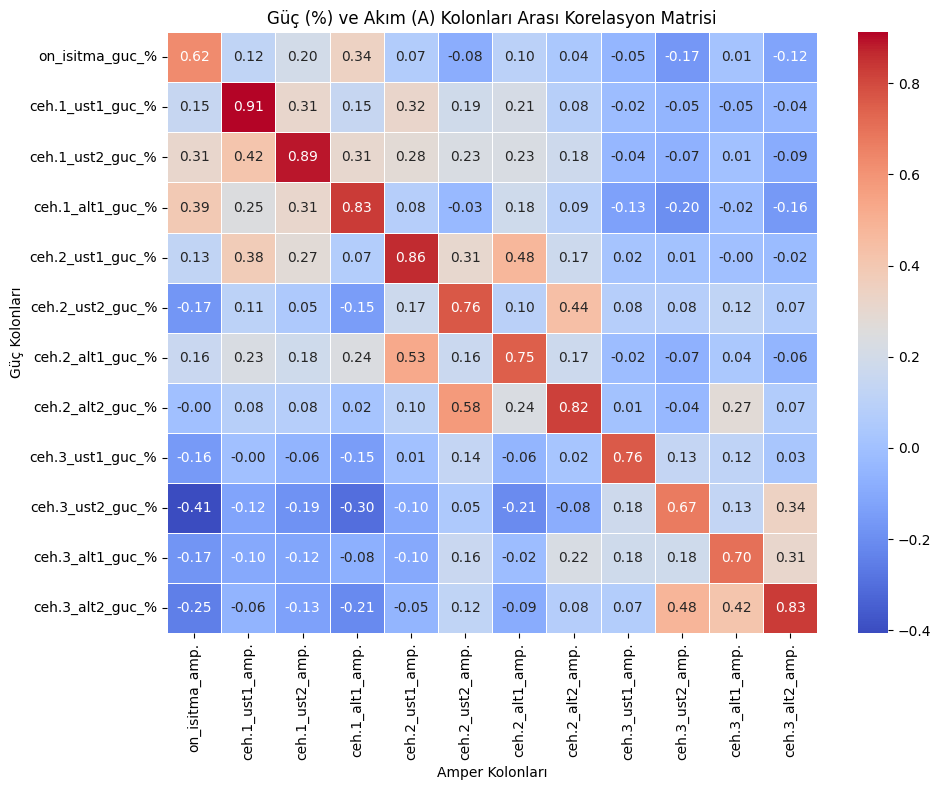

Her bileşen için güç (%) ve akım (Amp) değerleri arasındaki korelasyon aşağıdaki gibidir:


| Bileşen        | Güç Kolonu            | Akım Kolonu            | Korelasyon |
|----------------|------------------------|--------------------------|------------|
| on_isitma      | on_isitma_guc_%        | on_isitma_amp.          | 0.62       |
| ceh.1_ust1      | ceh.1_ust1_guc_%       | ceh.1_ust1_amp.         | 0.91       |
| ceh.1_ust2      | ceh.1_ust2_guc_%       | ceh.1_ust2_amp.         | 0.89       |
| ceh.1_alt1      | ceh.1_alt1_guc_%       | ceh.1_alt1_amp.         | 0.83       |
| ceh.2_ust1      | ceh.2_ust1_guc_%       | ceh.2_ust1_amp.         | 0.86       |
| ceh.2_ust2      | ceh.2_ust2_guc_%       | ceh.2_ust2_amp.         | 0.76       |
| ceh.2_alt1      | ceh.2_alt1_guc_%       | ceh.2_alt1_amp.         | 0.75       |
| ceh.2_alt2      | ceh.2_alt2_guc_%       | ceh.2_alt2_amp.         | 0.82       |
| ceh.3_ust1      | ceh.3_ust1_guc_%       | ceh.3_ust1_amp.         | 0.76       |
| ceh.3_ust2      | ceh.3_ust2_guc_%       | ceh.3_ust2_amp.         | 0.67       |
| ceh.3_alt1      | ceh.3_alt1_guc_%       | ceh.3_alt1_amp.         | 0.70       |
| ceh.3_alt2      | ceh.3_alt2_guc_%       | ceh.3_alt2_amp.         | 0.83       |


- 0.90+ → Sensörler arasında güçlü ilişki.
- 0.60–0.80 → Orta düzeyde ilişki, anomali riski olabilir.

- Korelasyonu yüksek olan sensör çiftleri, güç ve akım değerlerinin birlikte tutarlı şekilde değiştiğini gösterir. Bu sayede arızalara dair fiziksel olarak anlamlı ve güvenilir sinyaller yakalanabilir, model daha doğru sınıflandırma yapabilir. 

- Bundan dolayı işlemler için korelasyonu 0.80'den fazla olan kolon çiftleri tercih edildi.

- **Seçilen Kolon Çiftleri:**

```
    ('ceh.1_ust1_guc_%', 'ceh.1_ust1_amp.')
    ('ceh.1_ust2_guc_%', 'ceh.1_ust2_amp.')
    ('ceh.1_alt1_guc_%', 'ceh.1_alt1_amp.')
    ('ceh.2_ust1_guc_%', 'ceh.2_ust1_amp.')
    ('ceh.2_ust2_guc_%', 'ceh.2_ust2_amp.')
    ('ceh.2_alt1_guc_%', 'ceh.2_alt1_amp.')
    ('ceh.2_alt2_guc_%', 'ceh.2_alt2_amp.')
    ('ceh.3_alt2_guc_%', 'ceh.3_alt2_amp.')
```

## 🔧 Sensör Durum Sınıflandırması

Amaç, güç (%) ve akım (amp) sensör değerleri arasındaki ilişkiye göre fırın bileşenlerinin durumlarını sınıflandırmak ve arıza anlarını analiz etmek.

### 🚫 Bu Verilerde Anomali Tespiti İçin Neden Rolling Z-score Uygun Değil?
- Güç ve akım verilerinde sık sık ani değişim ve sıfırlanma olur.
- Rolling z-score bu gibi değişken ortamlarda fazla yanlış pozitif üretir.
- Bu nedenle kural tabanlı sınıflandırma tercih edilmiştir.

### Kural Tabanlı Sınıflandırma

**Durum Sınıflandırma Kuralları:**

- `güç ≥ 9` ve `akım ≥ 100` → ✅ Isıtma aktif  
- `güç = 0` ve `akım = 0` → 🔍 Arızalı/Durmuş (Kontrol Edilmeli)  
- `güç = 0` ve `akım ≥ 100` → ⚠️ Güç sensör hatası  
- `güç ≥ 9` ve `akım = 0` → ⚠️ Akım sensör hatası  
- Diğer durumlar → 🤔 Diğer


### 🔥 Bileşen Bazlı Durum Özeti Tablosu


| Bileşen           | Isıtma Aktif | Arızalı/Durmuş | Akım Sensör Hatası  | Güç Sensör Hatası  | Diğer  |
|-------------------|--------------|----------------|---------------------|--------------------|--------|
| ceh.1_ust1        | 17,951       | 3,664          | 414                 | 73                 | 38     |
| ceh.1_ust2        | 20,132       | 1,111          | 431                 | 27                 | 439    |
| ceh.1_alt1        | 17,669       | 2,500          | 1,222               | 364                | 385    |
| ceh.2_ust1        | 20,577       | 1,008          | 429                 | 41                 | 85     |
| ceh.2_ust2        | 18,511       | 2,883          | 652                 | 40                 | 54     |
| ceh.2_alt1        | 19,954       | 1,077          | 983                 | 69                 | 57     |
| ceh.2_alt2        | 17,031       | 744            | 462                 | 25                 | 3,878  |
| ceh.3_alt2        | 21,316       | 421            | 365                 | 23                 | 15     |


#### Toplam uyarı sayısı hesaplanması içi: 
Her satır için tüm bileşenlerin durumlarını taranır ve eğer herhangi birinde bir uyarı durumu varsa o satıra '🚨 Uyarı', yoksa '✅ Normal' etiketi verilir.

- Toplam veri sayısı: 22.140
- 🚨 Uyarı     11.286
- ✅ Normal     10.854
- Uyarı Oranı: %50.97

## Arızalar İçin Durum Analizi

Amaç, üretim sürecinde yaşanan arızaları sistematik olarak tespit ederek, bu arızaların ne zaman, ne kadar süreyle ve ne sıklıkla meydana geldiğini analiz etmektir.

1) Durum Sınıflandırma:
    - Güç (%) ve akım (Amp) değerlerine göre her satırda çalışma durumu belirlenir. 

2) Uzun Süreli Arıza Tespiti:
    - Mesai saatleri içinde (08:00–16:59) en az 5 dakika süren arıza blokları bulunur. Başlangıç, bitiş, süre ve tekrar sayısı raporlanır.

3) Günlük Duruş Süresi Grafiği:
    - Hangi gün ne kadar süre arıza olmuş, bar grafikle gösterilir.

4) Saatlik Duruş Süresi Grafiği:
    - Arızaların en yoğun yaşandığı saatler görselleştirilir.

5) Arıza Anında Güç ve Akım Grafiği:
    - Arıza zamanlarında güç ve akım değerlerinin nasıl değiştiği zaman serisi grafiğiyle analiz edilir.


### **ceh.1_alt1_guc_%** & **ceh.1_alt1_amp.** Kolon Çifti İçin Grafikler: 

#### 🔍 Arızalı/Durmuş Kontrol Edilmeli Arızası 

**Günlük Duruş Süresi:** 

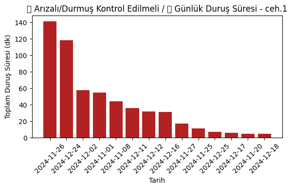

**Saatlik Duruş Süresi:**

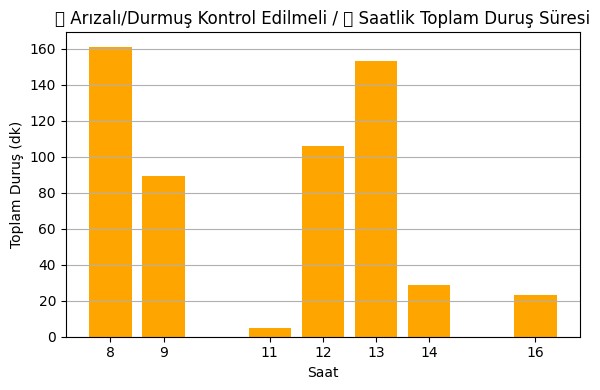

**Güç ve Akım Değişimi**:

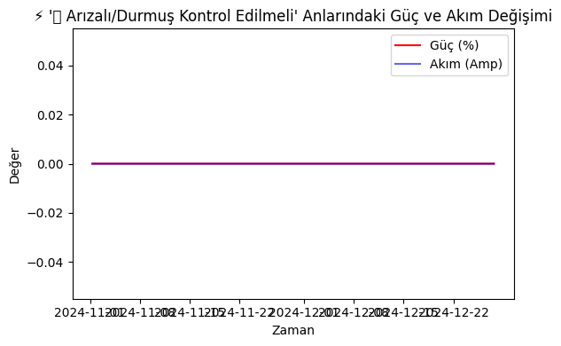

---

#### ⚠️ Güç Sensör Hatası Arızası

**Günlük Duruş Süresi:** 

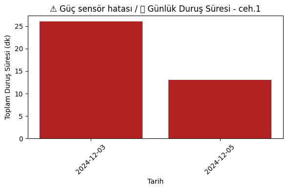

**Saatlik Duruş Süresi:** 

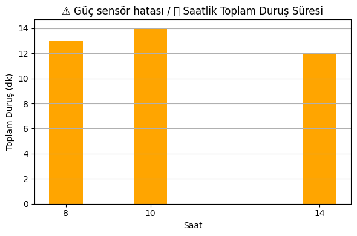

**Güç ve Akım Değişimi**:

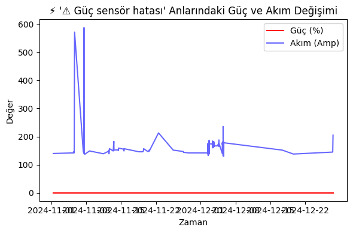

--- 

#### ⚠️ Akım Sensör Hatası Arızası

**Günlük Duruş Süresi:**  

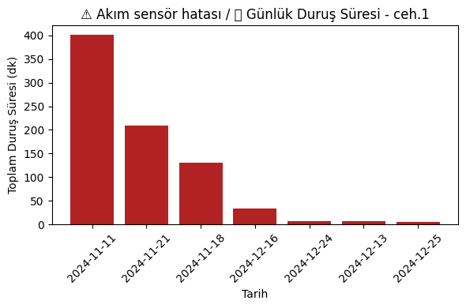

**Saatlik Duruş Süresi:**

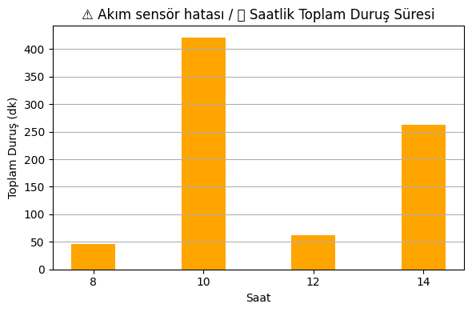

**Güç ve Akım Değişimi**:

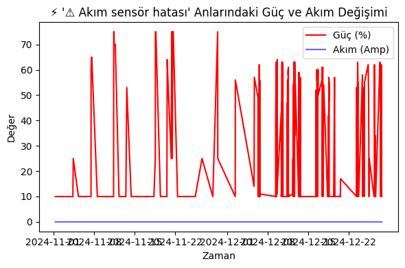