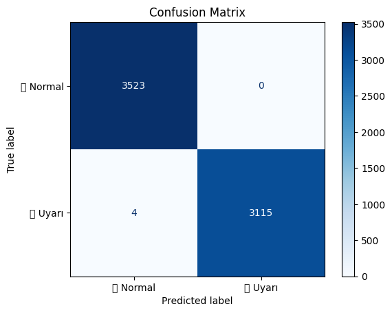
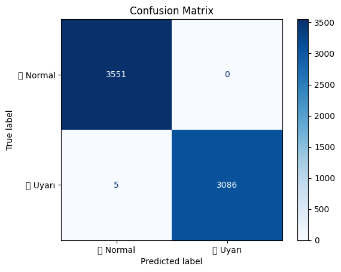

# 🔧 Fırın Sistemlerinde Güç ve Amper Sensör Verileri ile Arıza Tahmin Modeli Geliştirilmesi

Bu model, fırın sistemlerindeki sensör verileri (güç ve amper) üzerinden potansiyel arıza durumlarını otomatik olarak tespit etmek ve anlamlı sınıflandırmalar yapmak amacıyla geliştirilmiştir.

---

## 📌 1. Durum Sınıflandırması

Her **güç (%)** ve **akım (amp)** sensör çifti için özel bir durum sınıflandırması yapılmıştır.

**Güç Amper Korelasyonları:**


- Güç ve amper kolonlarından **korelasyonu 0.80'den yüksek** çiftler seçilerek modelde kullanılmıştır.
- Seçilen kolon Çiftleri: 
```text
    ('ceh.1_ust1_guc_%', 'ceh.1_ust1_amp.')
    ('ceh.1_ust2_guc_%', 'ceh.1_ust2_amp.')
    ('ceh.1_alt1_guc_%', 'ceh.1_alt1_amp.')
    ('ceh.2_ust1_guc_%', 'ceh.2_ust1_amp.')
    ('ceh.2_ust2_guc_%', 'ceh.2_ust2_amp.')
    ('ceh.2_alt1_guc_%', 'ceh.2_alt1_amp.')
    ('ceh.2_alt2_guc_%', 'ceh.2_alt2_amp.')
    ('ceh.3_alt2_guc_%', 'ceh.3_alt2_amp.')
```

### ➕ Kullanılan Kurallar:

- `güç ≥ 9` ve `akım ≥ 100` → ✅ Isıtma aktif  
- `güç = 0` ve `akım = 0` → 🔍 Arızalı/Durmuş (Kontrol Edilmeli)  
- `güç = 0` ve `akım ≥ 100` → ⚠️ Güç sensör hatası  
- `güç ≥ 9` ve `akım = 0` → ⚠️ Akım sensör hatası  
- Diğer durumlar → 🤔 Diğer


### ➕ Oluşan Sütunlar:

```text
 ceh.1_ust1_durum, ceh.1_ust2_durum, ...
```

---

## 🚨 2. Genel Uyarı Sütunu (`genel_uyari`)

Tüm `*_durum` sütunları birleştirilerek satır bazında genel uyarı oluşturulmuştur:

- Eğer satırda herhangi bir uyarı durumu varsa → `🚨 Uyarı`  
- Tüm durumlar normalse → `✅ Normal`

```python
uyari_durumlari = [
    '🔍 Arızalı/Durmuş Kontrol Edilmeli',
    '⚠️ Akım sensör hatası',
    '⚠️ Güç sensör hatası',
    '🤔 Diğer'
]

df['genel_uyari'] = df[durum_kolonlari].apply(
    lambda row: '🚨 Uyarı' if any(durum in uyari_durumlari for durum in row) else '✅ Normal',
    axis=1
)
```

Toplam satır sayısı: 22140
- 🚨 Uyarı     11742
- ✅ Normal     10398

---

## 🎯 3. Hedef Değişkenin Hazırlanması

- `genel_uyari` sütunu sayısallaştırıldı:
  - `🚨 Uyarı` → 1  
  - `✅ Normal` → 0

---

## 🤖 4. Tüm Sensörler ile Model Eğitimi

- **Model:** `LightGBMClassifier`
- **Girdi Özellikleri:** Tüm sensör sütunları (güç, akım, ısı vs.)
- **Eğitim/Test Ayrımı:** %70 eğitim, %30 test  
- **Performans:**  
  Yapılan testlerde `Uyarı` ve `Normal` sınıflarını ayırt edebildi.

**Karmaşıklık Matrisi:**




---

## 📊 5. Öznitelik (Feature) Seçimi

### a) Korelasyon Analizi:

- `genel_uyari_flag` ile korelasyonu en yüksek olan sütunlar belirlendi.

### b) LightGBM Feature Importance:

- Modelden alınan `feature_importances_` kullanılarak en etkili sütunlar sıralandı:

```text
- ceh.2_ust2_amp.
- ceh.3_alt1_amp.
- ceh.2_ust1_amp.
- ceh.2_alt1_amp.
- on_isitma_amp.
...
```


## 🤖 6. Seçilen Sensörler ile Model Eğitimi

- **Model:** `LightGBMClassifier`
- **Girdi Özellikleri:** En etkili sensör sütunları.
- **Eğitim/Test Ayrımı:** %70 eğitim, %30 test (stratify ile)
- **Performans:**  
  Yapılan testlerde `Uyarı` ve `Normal` sınıflarını ayırt edebildi.

Karmaşıklık Matrisi: 




---

## ✅ Sonuç

Bu pipeline, fırın sistemlerinden gelen sensör verileriyle otomatik olarak:

- Anlık durumları sınıflandırır.
- Genel bir arıza veya uyarı durumu üretir.
- Makine öğrenmesi modeliyle bu durumları tahmin eder.
- En kritik sensörleri ön plana çıkarır.

---
