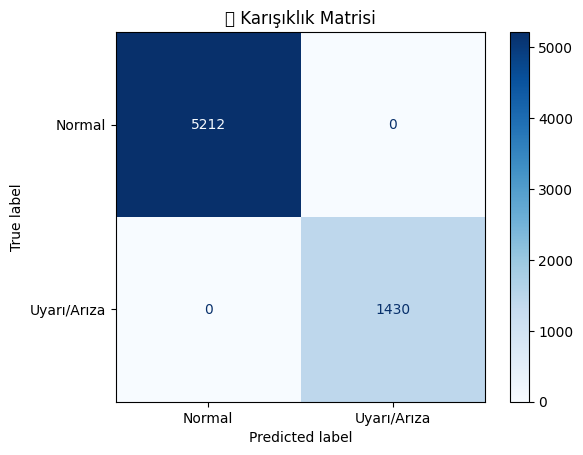

## Fırın Sistemlerinde Sıcaklık, Fan, Rulo Sensör Verileri ile Arıza Tahmin Modeli Geliştirilmesi

Bu model, fırın sistemlerindeki sensör verileri (sıcaklık, fan hızı, rulo frekansı) üzerinden potansiyel arıza durumlarını otomatik olarak tespit etmek ve anlamlı sınıflandırmalar yapmak amacıyla geliştirilmiştir. 

## 📌 1. Veri Seti

Sıcaklık, fan, rulo gibi sensör sütunları ile oluşturulan uyarı sistemi sonrasında elde edilen etiketli veri seti kullanılır.  (ariza_tahmin_modeli_sicaklik_fan_rulo_verisi.csv)


### ➕ Modelde Kullanılacak Sütunlar:

- `giris_isi`
- `on_isitma_isi`
- `sogutma1_isi`
- `sogutma2_isi`
- `sogutma3_isi`
- `rulo_frekans_hz`
- `giris_per.fan_hz`

 
## 🎯 2. Hedef Değişkenin Hazırlanması

- `uyari` sütunu sayısallaştırıldı: 
  - `✅ Normal` → 0
  - Diğer Uyarı durumları → 1


## 🤖 3. Tüm Sensörler ile Model Eğitimi

- **Model:** `RandomForestClassifier`
- **Girdi Özellikleri:** Tüm sensör sütunları
- **Eğitim/Test Ayrımı:** %70 eğitim, %30 test 
- **Performans:**  
  Yapılan testlerde `Uyarı` ve `Normal` sınıflarını ayırt edebildi.

Karmaşıklık Matrisi:



## 📊 4. Öznitelik (Feature) Seçimi

Eğitilen RandomForestClassifier modelinden elde edilen özellik önem (feature importance) skorları kullanılarak sensör sütunlarının model üzerindeki etkisi analiz edilmiştir. En etkili sütunlarla model yeniden eğitilmiştir.

```text 
- giris_per.fan_hz
- giris_isi
- sogutma2_isi
- rulo_frekans_hz
```


## 🤖 5. Seçilen Sensörler ile Model Eğitimi

- **Model:** `RandomForestClassifier`
- **Girdi Özellikleri:** En etkili sensör sütunları
- **Eğitim/Test Ayrımı:** %70 eğitim, %30 test 
- **Performans:**  
  Yapılan testlerde `Uyarı` ve `Normal` sınıflarını ayırt edebildi.

Karmaşıklık Matrisi: 


## ✅ Sonuç

Bu pipeline, fırın sistemlerinden gelen sensör verileriyle otomatik olarak:

- Anlık durumları sınıflandırır.
- Genel bir arıza veya uyarı durumu üretir.
- Makine öğrenmesi modeliyle bu durumları tahmin eder.
- En kritik sensörleri ön plana çıkarır.