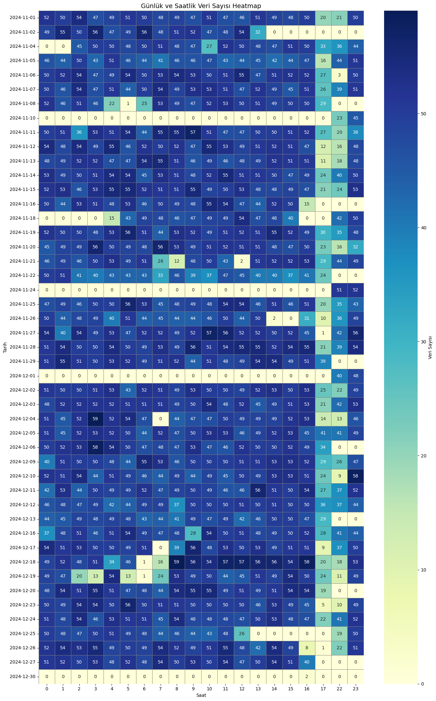
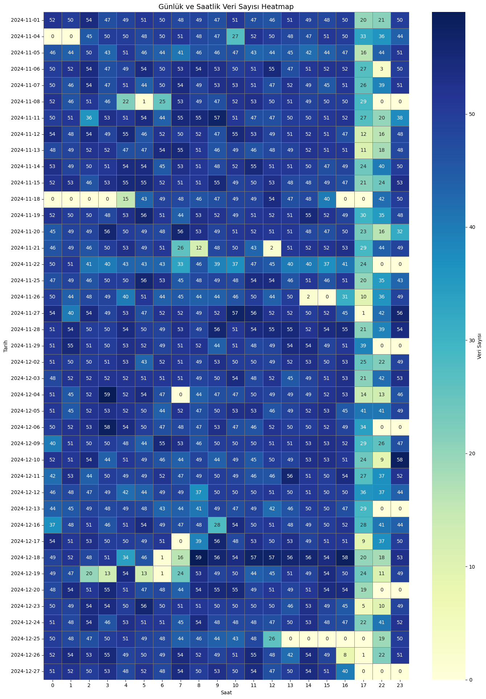
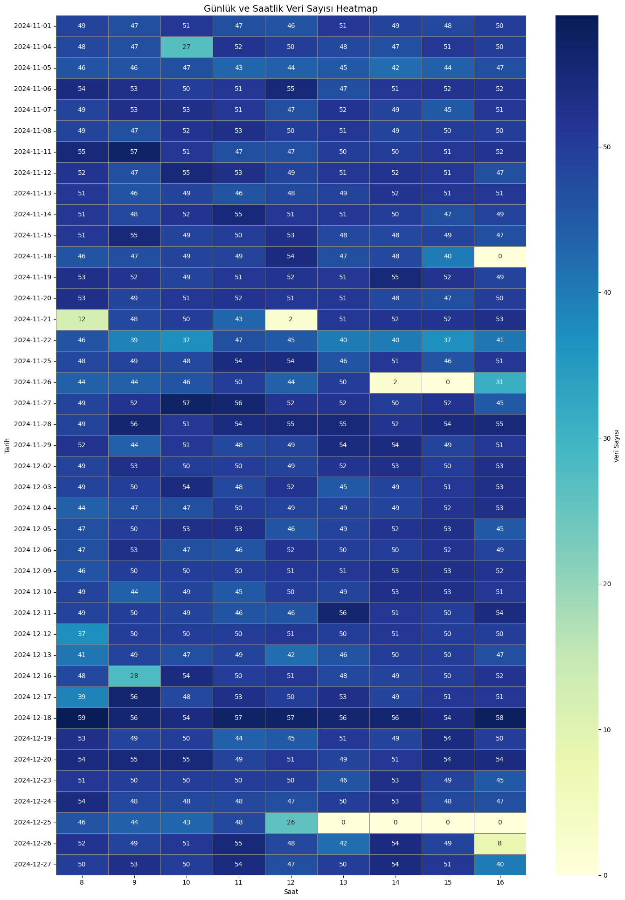
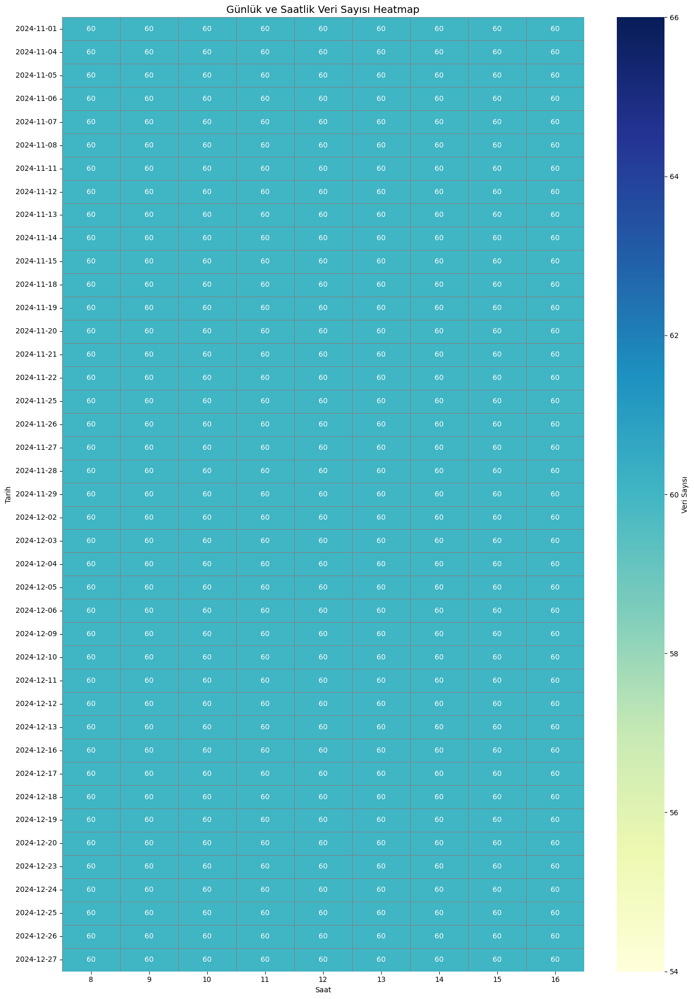

# FIRIN VERİLERİ TEMİZLEME

## ✨ Genel Bakış
Bu veri seti, bir metal fırınından alınan şu sensör ölçümlerini içerir:
- Sıcaklık 
- Güç (Power %)
- Akım (Amp.)
- Fan Frekansları (Hz)
- Zaman (Hangi tarih ve saatte veri çekilmiş)
- Ölçüm Bölgeleri: CEH.1, CEH.2, CEH.3  (ALT ve ÜST)

### 📊 Veri Boyutu ve Türleri
Başlangıçtaki veri: 
- Gözlem Sayısı (satır): 38792
- Özellik Sayısı (sütun): 58
- Eksik Veri Sayısı (Sütunlar eksik ver içeriyor mu?) : 0
- Veri türleri:
  - `saat` sütunu veri türü: object
  - `tarih` sütunu veri türü: datetime64
  - Diğer sütunların veri türleri: int64


## Ölçüm Bölgeleri ve Amaçları

| Bölge         | Görev                 | Sıcaklık Aralığı       | Teknik Amaç                                              |
|---------------|----------------------|------------------------|-----------------------------------------------------------|
| ÖN ISITMA    | İlk hazırlık           | Daha düşük               | Malzeme termal şoka girmesin, yavaşça ısınsın            |
| CEH.1         | Ana giriş ısıtması     | Orta düzey               | Malzeme çekirdeği ısınmaya başlar                    |
| CEH.2         | Isı dengelenme        | Yüksek                  | Malzeme tamamen ısınır, homojen sıcaklık               |
| CEH.3         | Çıkış kontrolü        | Yüksek / Düşen         | Son kontroller, çıkış sıcaklığı optimize edilir |

## 📃 Sütun Adları Düzenleme
- Sütun adları düzenlendi: Boşluklar alt çizgiye çevrildi, Türkçe karakterler kaldırıldı. *(GİRİŞ ISI -> giris_isi)*
- `tarih` ve `saat` sütunları birleştirilerek yeni bir **`datetime`** sütunu oluşturuldu.

## ⏰ Dakika'da Bir Veri Çekilmesi Sağlandı 
- Veri setinde aynı dakika içinde birden fazla ölçüm yer aldığı durumlar tespit edildi. Bu tekrar eden veriler, zaman serisi analizini bozabileceği ve çakışmalara yol açabileceği için, aynı dakika içindeki çoklu kayıtlar kaldırıldı, sadece ilk kayıt bırakıldı.

- Satır sayısı: **38792 → 38472**

## ❌ Eksik Zaman Aralıkları ve Temizlik
- Belirtilen datetime sütununa göre günlük ve saatlik eksik zaman aralıkları tespit edildi. 
- Ayrıca günlük ve saatlik veri yoğunluğunu gösteren heatmapler çizildi. 
    -  Başlangıçta veri yoğunluğu: Heatmap 1
- Bazı tarihlerde (gün bazlı) veya saatlerde veri tamamen eksikti.
  Örn: 
```
2024-12-30 tarihinde eksik zaman aralıkları:
- 00:00 ile 16:40 arası eksik
- 16:43 ile 23:59 arası eksik
Toplam eksik dakika: 1438 dk
     
2024-12-29 tarihinde eksik zaman aralıkları:
- Tüm gün veri yok
Toplam eksik dakika: 1440 dk
```
- Bu bilgilere göre belirlenen zaman aralıkları ve günler veriden çıkarıldı: 
  - 2024-12-30 tarihinde sadece 2 dk'lık veri vardı, bu gün çıkarıldı.
  - Hafta sonları (Cumartesi & Pazar) veriler tutarsız olduğu için **tümü analiz dışı bırakıldı**. (Bazı haftalarda sadece cumartesi günü, bazılarında sadece pazar günü, bazı haftalarda hiç yok veya çok az veri var.)
      - Belirli günler çıkarıldıktan sonra veri yoğunluğu: Heatmap 2
  - Saatlik Yoğunluk: Veri seti mesai saatlerinde (08:00–17:00) yoğun. Bu sebeple **sadece bu saat dilimi analizde kullanıldı**.
      - Belirli saatler çıkarıldıktan sonra veri yoğunluğu: Heatmap 3
- Satır sayısı: **38472 → 36708 → 17788**


## ⏰ Dakikalık Veri Tamamlama
- Var olan tüm tarihler için 08:00-16:59 aralığında dakikalık zaman serisi oluşturuldu.
- Gerçek veri ile bu eksiksiz zaman tablosu ortak olan `datetime` sütunu üzerinden birleştirildi.
- Eksik zamanlara **NaN** eklendi.
    - Son haldeki veri yoğunluğu: Heatmap Son
 

- Gereksiz ara sütunlar silindi. (saat, tarih, işlemlerde kullanmak için oluşturulan sütunlar)
- Satır Sayısı: **17788 → 22140 satır**

## 🌐 Eksik Değer Doldurma
### a) Mod (mode) ile doldurulan sütunlar:
Veri setine bakıldığında sabit veya az değişen sütunlar:
- `prg`, `on_isitma_set_isi`, `ceh.1_ust1_set_isi`, `ceh.1_ust2_set_isi`, `ceh.1_alt1_set_isi`, ...
- `rulo_frekans_hz`, `giris_per.fan_hz`, `cikis_per.fan_hz`, `on_isitma_guc_%`

> Bu sütunlarda mod (en sık değer) alındı ve NaN alanlar bu değerle dolduruldu.

### b) Forward Fill (ffill) ile doldurma
Kalan diğer sütunlar: 
- Son bilinen değer, sonraki NaN'a aktırıldı.
- Bu, sensör verileri için mantıklı bir tahmin yöntemidir.

## 📅 Son Durum
- Veri seti 41 gün x 9 saat x 60 dk olacak şekilde tamamlandı.
- Gözlem Sayısı (satır): 22140
- Özellik Sayısı (sütun): 57
- Sütun bazlı eksik veri yok.


---

**Heatmap 1:**

 

**Heatmap 2:**

 

**Heatmap 3:**



**Heatmap Son:**

